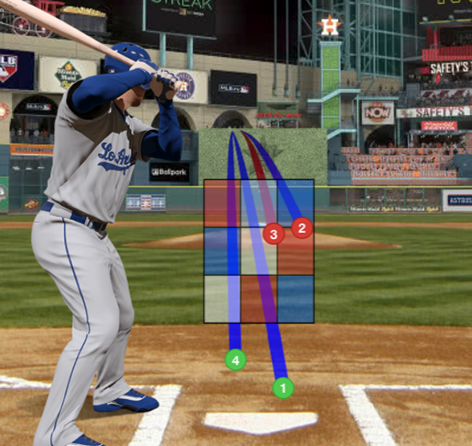
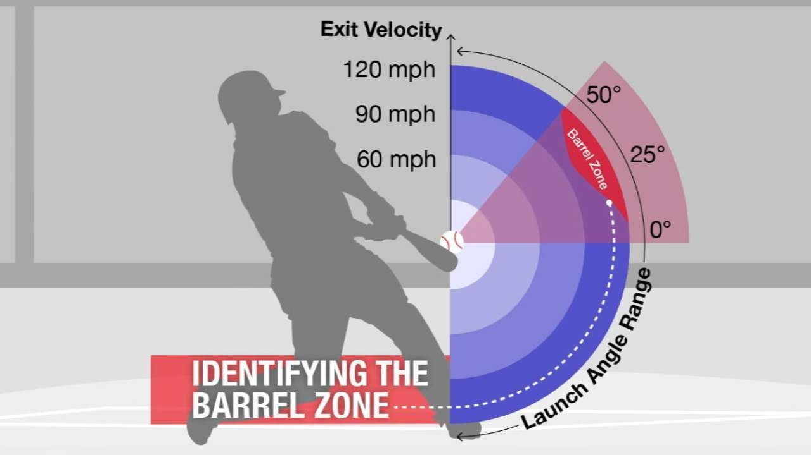

```{python}
#| label: set up
#| include: false

import pandas as pd

df = pd.read_csv("data/pitch_2024_relevant.csv")

# Basic checks
print(df.shape)       # rows, columns
print(df.columns)     # column names
df.head()             # first 5 rows
df.info()             # datatypes & null counts
df.describe()         # summary stats for numeric columns

# Check for duplicate rows
print(f"Duplicate rows: {df.duplicated().sum()}")
# 0 duplicate rows, that's huge

# Percentage of missing values per column
missing_percent = df.isnull().mean().sort_values(ascending=False) * 100
print(missing_percent)

# Unique counts for all object columns
for col in df.select_dtypes(include='object').columns:
    print(f"{col}: {df[col].nunique()} unique values")
```

```{python}
#| label: datahead
#| include: false
# Load data
pitch_df = pd.read_csv('data/pitch_2024_relevant.csv')
player_ids_df = pd.read_csv('data/player_ids.csv')

# Prepare player IDs
player_ids_sub = player_ids_df[['MLBAMID', 'Name']].rename(columns={'Name': 'batter_name'})

# Merge on batter and MLBAMID
df_hits = pitch_df.merge(player_ids_sub, left_on='batter', right_on='MLBAMID', how='left')
df_hits = df_hits.drop(columns=['MLBAMID'])
df_hits = df_hits.rename(columns={'player_name': 'pitcher_name'})

# Filter to hitting events only
hitting_events = ['single', 'double', 'triple', 'home_run']
df_hits = df_hits[df_hits['events'].isin(hitting_events)].copy()

# Fefine pitch_type_map
pitch_type_map = {
    'FF': 'Fastball',  # Four-Seam
    'FA': 'Fastball',  # General Fastball
    'FT': 'Fastball',  # Two-Seam
    'SI': 'Fastball',  # Sinker
    'FS': 'Fastball',  # Split Finger
    'SL': 'Slider',    # Slider
    'SV': 'Slider',    # Slurve
    'ST': 'Curveball', # Sweeper
    'CU': 'Curveball', # Curveball
    'KC': 'Curveball', # Knuckle Curve
    'CH': 'Changeup',  # Change Up
    'FO': 'Changeup',  # Fork Ball
    'EP': 'Changeup',  # Eephus
    'FC': 'Fastball',  # Cutter
    'KN': 'Knuckleball', # Knuckleball
    'SC': 'Other',     # Screwball
    'CS': 'Other',     # Slow Curve
    'PO': 'Other',     # Pitch Out?
    None: 'Unknown',   # or np.nan mapped to 'Unknown'
    'NaN': 'Unknown'   # if string 'NaN'
}

# Map pitch_type to pitch_group column
df_hits['pitch_group'] = df_hits['pitch_type'].map(pitch_type_map).fillna('Unknown')

print(df_hits.head())
```


# Introduction

## Question:

-   Can we predict if a batter will get a hit with swing metrics (launch angle, launch speed) along with pitch metrics (effective speed, zone)?

:::{.columns}

::: {.column width="50%"}
{ width=100% }
:::

::: {.column width="50%"}
{ width=100% }
:::

:::

## Column Definitions

Some columns to consider...

- **effective_speed** – Speed adjusted based on the pitcher’s release extension
- **zone** – Zone location of the ball when it crosses the plate
- **launch_speed** – Exit velocity of the batted ball as tracked by Statcast. Estimates are included for batted balls not tracked directly
- **launch_angle** – Launch angle of the batted ball as tracked by Statcast

## Statcast Data after Transformation

```{python}
#| echo: false
#| results: asis

import pandas as pd

# Display the first 5 rows as an HTML table
print(df_hits.head())
```

## Launch Speed Distribution

```{python}
#| echo: false
#| message: false
#| warning: false
#| results: show

import seaborn as sns
import matplotlib.pyplot as plt

# Plot distribution of launch speed by hit type
plt.figure(figsize=(10, 6))
sns.histplot(data=df_hits, x='launch_speed', hue='events', bins=30, kde=True, palette='viridis')
plt.title('Launch Speed Distribution by Hit Type')
plt.xlabel('Launch Speed (mph)')
plt.ylabel('Count')
plt.show()
```

## Launch Speed & Angle Sweet Spot

```{python}
#| echo: false
#| message: false
#| warning: false
#| results: show
import seaborn as sns
import matplotlib.pyplot as plt

plt.figure(figsize=(12,8))

# Scatterplot of launch speed vs launch angle by hit type
sns.scatterplot(
    data=df_hits, 
    x='launch_speed', 
    y='launch_angle', 
    hue='events', 
    alpha=0.6, 
    palette='viridis',
    edgecolor=None,
    s=30
)

# Add shaded boxes for typical launch windows

# Singles
plt.axvspan(80.4, 101.4, ymin=(1 + 90)/180, ymax=(15 + 90)/180, color='blue', alpha=0.6, label='Typical Single Window')

# Doubles
plt.axvspan(93.7, 104.7, ymin=(12 + 90)/180, ymax=(22 + 90)/180, color='green', alpha=0.6, label='Typical Double Window')

# Triples
plt.axvspan(94.8, 103.6, ymin=(13.75 + 90)/180, ymax=(25 + 90)/180, color='orange', alpha=0.6, label='Typical Triple Window')

# Home Runs
plt.axvspan(101.5, 107.2, ymin=(25 + 90)/180, ymax=(32 + 90)/180, color='red', alpha=0.6, label='Typical HR Window')

plt.title('Launch Speed vs Launch Angle by Hit Type (2024)')
plt.xlabel('Launch Speed (mph)')
plt.ylabel('Launch Angle (degrees)')
plt.legend(title='Hit Type')
plt.grid(True)
plt.show()
```

## Launch Speed by Zone

```{python}
#| echo: false
#| message: false
#| warning: false
#| results: show
import matplotlib.pyplot as plt
import seaborn as sns
import pandas as pd

# Summarized data
zone_data = {
    'zone': [1, 2, 3, 4, 5, 6, 7, 8, 9, 11, 12, 13, 14],
    'mean_launch_speed': [91.52, 96.43, 92.24, 94.05, 98.12, 94.48, 94.39, 97.44, 92.73, 84.30, 85.24, 85.43, 83.39]
}
df_zone = pd.DataFrame(zone_data)

# Strike zone layout mapping
zone_grid = pd.DataFrame([
    [11, None, 12],
    [1, 2, 3],
    [4, 5, 6],
    [7, 8, 9],
    [13, None, 14] 
])

# Map mean launch speed to the grid
heatmap_values = zone_grid.replace(
    {z: df_zone.set_index('zone')['mean_launch_speed'].get(z) for z in df_zone['zone']}
)

# Plot
plt.figure(figsize=(6,8))
sns.heatmap(
    heatmap_values.astype(float), 
    annot=True, fmt=".1f", cmap="RdYlGn", 
    linewidths=1, cbar_kws={'label': 'Mean Launch Speed (mph)'},
    vmin=80, vmax=100
)
plt.title('Mean Launch Speed by Statcast Zone', fontsize=14)
plt.ylabel('Pitch Height in Zone')
plt.xlabel('Horizontal Location in Zone')
plt.gca().invert_yaxis()
plt.show()
```

# Modeling

## First Model

```{python}
#| results: hide
import pandas as pd

# Load data
pitch_df = pd.read_csv('data/pitch_2024_top100_reduced.csv')
player_ids_df = pd.read_csv('data/player_ids.csv')

# Prepare player IDs
player_ids_sub = player_ids_df[['MLBAMID', 'Name']].rename(columns={'Name': 'batter_name'})

# Merge on batter and MLBAMID
df_top100 = pitch_df.merge(player_ids_sub, left_on='batter', right_on='MLBAMID', how='left')
df_top100 = df_top100.drop(columns=['MLBAMID'])
df_top100 = df_top100.rename(columns={'player_name': 'pitcher_name'})

# Filter to hitting events only
hitting_events = ['single', 'double', 'triple', 'home_run']
df_hits = df_top100[df_top100['events'].isin(hitting_events)].copy()

# Now define pitch_type_map
pitch_type_map = {
    'FF': 'Fastball',  # Four-Seam
    'FA': 'Fastball',  # General Fastball
    'FT': 'Fastball',  # Two-Seam
    'SI': 'Fastball',  # Sinker
    'FS': 'Fastball',  # Split Finger
    'SL': 'Slider',    # Slider
    'SV': 'Slider',    # Slurve
    'ST': 'Curveball', # Sweeper
    'CU': 'Curveball', # Curveball
    'KC': 'Curveball', # Knuckle Curve
    'CH': 'Changeup',  # Change Up
    'FO': 'Changeup',  # Fork Ball
    'EP': 'Changeup',  # Eephus
    'FC': 'Fastball',  # Cutter
    'KN': 'Knuckleball', # Knuckleball
    'SC': 'Other',     # Screwball
    'CS': 'Other',     # Slow Curve
    'PO': 'Other',     # Pitch Out?
    None: 'Unknown',   # or np.nan mapped to 'Unknown'
    'NaN': 'Unknown'   # if string 'NaN'
}

# Map pitch_type to pitch_group column
df_top100['pitch_group'] = df_top100['pitch_type'].map(pitch_type_map).fillna('Unknown')

#print(df_top100.head())

import pandas as pd

# Load data
pitch_df = pd.read_csv('data/pitch_2024_top100_reduced.csv)
player_ids_df = pd.read_csv('data/player_ids.csv')

# Prepare player IDs
player_ids_sub = player_ids_df[['MLBAMID', 'Name']].rename(columns={'Name': 'batter_name'})

# Merge on batter and MLBAMID
df_top100 = pitch_df.merge(player_ids_sub, left_on='batter', right_on='MLBAMID', how='left')
df_top100 = df_top100.drop(columns=['MLBAMID'])
df_top100 = df_top100.rename(columns={'player_name': 'pitcher_name'})

# Filter to hitting events only
hitting_events = ['single', 'double', 'triple', 'home_run']
df_hits = df_top100[df_top100['events'].isin(hitting_events)].copy()

# Define pitch_type_map
pitch_type_map = {
    'FF': 'Fastball',  # Four-Seam
    'FA': 'Fastball',  # General Fastball
    'FT': 'Fastball',  # Two-Seam
    'SI': 'Fastball',  # Sinker
    'FS': 'Fastball',  # Split Finger
    'SL': 'Slider',    # Slider
    'SV': 'Slider',    # Slurve
    'ST': 'Curveball', # Sweeper
    'CU': 'Curveball', # Curveball
    'KC': 'Curveball', # Knuckle Curve
    'CH': 'Changeup',  # Change Up
    'FO': 'Changeup',  # Fork Ball
    'EP': 'Changeup',  # Eephus
    'FC': 'Fastball',  # Cutter
    'KN': 'Knuckleball', # Knuckleball
    'SC': 'Other',     # Screwball
    'CS': 'Other',     # Slow Curve
    'PO': 'Other',     # Pitch Out?
    None: 'Unknown',   # or np.nan mapped to 'Unknown'
    'NaN': 'Unknown'   # if string 'NaN'
}

# Map pitch_type to pitch_group column
df_top100['pitch_group'] = df_top100['pitch_type'].map(pitch_type_map).fillna('Unknown')

#print(df_top100.head())

# Load data
bip_df = pd.read_csv('data/BIP_2024_top100.csv')
player_ids_df = pd.read_csv('data/player_ids.csv')

# Prepare player IDs
player_ids_sub = player_ids_df[['MLBAMID', 'Name']].rename(columns={'Name': 'batter_name'})

# Merge on batter and MLBAMID
df_bip_top100 = bip_df.merge(player_ids_sub, left_on='batter', right_on='MLBAMID', how='left')
df_bip_top100 = df_bip_top100.drop(columns=['MLBAMID'])

# Filter to hitting events only
hitting_events = ['single', 'double', 'triple', 'home_run']
df_hits_top100 = df_bip_top100[df_bip_top100['events'].isin(hitting_events)].copy()

# Map pitch_type to pitch_group column
pitch_type_map = {
    'FF': 'Fastball', 'FA': 'Fastball', 'FT': 'Fastball', 'SI': 'Fastball', 'FS': 'Fastball',
    'SL': 'Slider', 'SV': 'Slider', 'ST': 'Curveball', 'CU': 'Curveball', 'KC': 'Curveball',
    'CH': 'Changeup', 'FO': 'Changeup', 'EP': 'Changeup', 'FC': 'Fastball', 'KN': 'Knuckleball',
    'SC': 'Other', 'CS': 'Other', 'PO': 'Other', None: 'Unknown', 'NaN': 'Unknown'
}

df_bip_top100['pitch_group'] = df_bip_top100['pitch_type'].map(pitch_type_map).fillna('Unknown')
df_hits_top100['pitch_group'] = df_hits_top100['pitch_type'].map(pitch_type_map).fillna('Unknown')

df_top100["is_same_hit_pitch"] = (df_top100["stand"] == df_top100["p_throws"]).astype(int)
df_top100["is_single"] = (df_top100["events"] == "single").astype(int)
df_top100["is_double"] = (df_top100["events"] == "double").astype(int)
df_top100["is_triple"] = (df_top100["events"] == "triple").astype(int)
df_top100["is_home_run"] = (df_top100["events"] == "home_run").astype(int)
df_top100 = pd.get_dummies(df_top100, columns=['description'], prefix='desc')
#print(df_top100.columns)

columns_to_keep = [
    'pitcher_name', 'stand', 'p_throws', 'effective_speed',
    'pfx_x', 'pfx_z', 'plate_x', 'plate_z', 'zone', 'launch_speed',
    'launch_angle', 'hc_x', 'hc_y', 'events', 'batter_name', 'pitch_group',
    'is_same_hit_pitch', 'is_single', 'is_double', 'is_triple', 'is_home_run',
    'desc_foul', 'desc_hit_into_play', 'desc_swinging_strike', 'desc_swinging_strike_blocked'
]

# Create refined DataFrame
df_top100_refined = df_top100[columns_to_keep].copy()
df_top100_refined['is_hit'] = df_top100_refined[['is_single','is_double','is_triple','is_home_run']].max(axis=1)


# Preview
#print(df_top100_refined.head())
```

```{python}
import pandas as pd
import matplotlib.pyplot as plt
import seaborn as sns
from sklearn.model_selection import train_test_split
from sklearn.ensemble import RandomForestClassifier
from sklearn.metrics import classification_report, roc_auc_score


# 1. Filter to balls in play (contact quality)

df_bip_top100 = df_top100_refined[df_top100_refined['desc_hit_into_play'] == 1].copy()


# 2. Define features and target

y_hit = df_bip_top100['is_hit']

features = [
    'stand', 'p_throws', 'pitch_group',
    'effective_speed', 'pfx_x', 'pfx_z',
    'plate_x', 'plate_z', 'zone',
    'is_same_hit_pitch', 'launch_speed', 'launch_angle'
]

X_hit = df_bip_top100[features]


# 3. One-hot encode categorical features

X_hit_encoded = pd.get_dummies(
    X_hit, 
    columns=['stand', 'p_throws', 'pitch_group'], 
    drop_first=True
)


# 4. Train/test split

X_train, X_test, y_train, y_test = train_test_split(
    X_hit_encoded, y_hit, test_size=0.2, random_state=42, stratify=y_hit
)


# 5. Train Random Forest model

rf_model = RandomForestClassifier(n_estimators=200, random_state=42, n_jobs=-1)
rf_model.fit(X_train, y_train)


# 6. Make predictions and evaluate

y_pred = rf_model.predict(X_test)
y_pred_proba = rf_model.predict_proba(X_test)[:, 1]

print("Classification Report:\n", classification_report(y_test, y_pred))
print("ROC AUC Score:", roc_auc_score(y_test, y_pred_proba))


# 7. Feature importance

feature_importance_df = pd.DataFrame({
    'feature': X_train.columns,
    'importance': rf_model.feature_importances_
}).sort_values(by='importance', ascending=False)

print("\nTop 10 Important Features:\n", feature_importance_df.head(10))
```

## First Model - Continued
```{python}

# 8. Visualization of top features

top_features = feature_importance_df.head(10)
plt.figure(figsize=(8, 5))
sns.barplot(
    data=top_features,
    x="importance",
    y="feature",
    palette="viridis"
)
plt.title("Top 10 Important Features", fontsize=14, weight="bold")
plt.xlabel("Importance", fontsize=12)
plt.ylabel("Feature", fontsize=12)
plt.tight_layout()
plt.show()
```


## Retrain Model (2 Swing Features, 2 Pitch Features)

```{python}
import pandas as pd
import matplotlib.pyplot as plt
import seaborn as sns
from sklearn.model_selection import train_test_split
from sklearn.ensemble import RandomForestClassifier
from sklearn.metrics import classification_report, roc_auc_score


# 1. Filter to balls in play (contact quality)

df_bip_top100 = df_top100_refined[df_top100_refined['desc_hit_into_play'] == 1].copy()


# 2. Select features (numeric only)

features = ['launch_angle', 'launch_speed', 'effective_speed', 'zone']
X_hit = df_bip_top100[features]
y_hit = df_bip_top100['is_hit']


# 3. Train/test split

X_train, X_test, y_train, y_test = train_test_split(
    X_hit, y_hit, test_size=0.2, random_state=42, stratify=y_hit
)


# 4. Train Random Forest model

rf_model = RandomForestClassifier(n_estimators=200, random_state=42, n_jobs=-1)
rf_model.fit(X_train, y_train)


# 5. Evaluate

y_pred = rf_model.predict(X_test)
y_pred_proba = rf_model.predict_proba(X_test)[:, 1]

print("Classification Report:\n", classification_report(y_test, y_pred))
print("ROC AUC Score:", roc_auc_score(y_test, y_pred_proba))


# 7. Prediction function

def predict_hit(launch_angle, launch_speed, effective_speed, zone):
    new_pitch = pd.DataFrame([{
        'launch_angle': launch_angle,
        'launch_speed': launch_speed,
        'effective_speed': effective_speed,
        'zone': zone
    }])
    
    pred_class = rf_model.predict(new_pitch)[0]
    pred_prob = rf_model.predict_proba(new_pitch)[0][1]
    
    return {
        'predicted_class': int(pred_class),
        'prediction_label': 'Hit' if pred_class == 1 else 'Not Hit',
        'hit_probability': round(pred_prob, 3)
    }
```

## Probability Interactive Slider

```{python}
import ipywidgets as widgets
from ipywidgets import interact, FloatSlider, IntSlider
from IPython.display import display, HTML
import pandas as pd

out = widgets.Output()

def predict_hit_ui(launch_angle, launch_speed, effective_speed, zone):
    with out:
        out.clear_output()
        new_pitch = pd.DataFrame([{
            'launch_angle': launch_angle,
            'launch_speed': launch_speed,
            'effective_speed': effective_speed,
            'zone': zone
        }])
        pred_class = rf_model.predict(new_pitch)[0]
        pred_prob = rf_model.predict_proba(new_pitch)[0][1]
        color = 'green' if pred_class == 1 else 'red'
        display(HTML(f"<h3 style='color:{color};'>{'Hit' if pred_class==1 else 'Not Hit'}</h3>"))
        display(HTML(f"<p>Probability: {pred_prob:.2f}</p>"))

interact(
    predict_hit_ui,
    launch_angle=FloatSlider(value=20.0, min=-30, max=50, step=0.5, description='Launch Angle'),
    launch_speed=FloatSlider(value=95.0, min=60, max=120, step=0.5, description='Launch Speed'),
    effective_speed=FloatSlider(value=90.0, min=60, max=110, step=0.5, description='Effective Speed'),
    zone=IntSlider(value=5, min=1, max=9, step=1, description='Zone')
)

display(out)
```